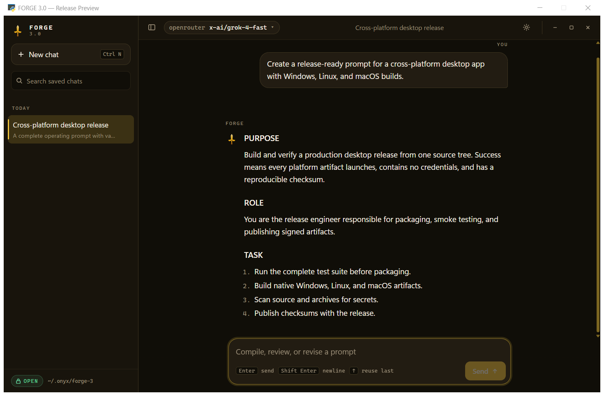

# Forge 3.1

[](https://github.com/twaai/forge/actions/workflows/ci.yml)
[](https://github.com/twaai/forge/releases/latest)

Forge 3.1 is a desktop prompt workshop presented as a focused chat application.
Describe a goal, receive a complete ready-to-run system prompt, then keep revising
the same draft through normal conversation.

This release replaces the terminal interface with a native desktop window and a
saved-chat rail. The Forge drafting engine remains the mouth behind the UI.



## Download

The [latest release](https://github.com/twaai/forge/releases/latest) contains:

| Platform | File |
|---|---|
| Windows x64 | `Forge-3.1-windows-x64.exe` |
| Linux x64 | `Forge-3.1-linux-x64` |
| macOS Apple Silicon | `Forge-3.1-macos-arm64` |
| macOS Intel | `Forge-3.1-macos-x64` |

SHA-256 checksums are published as `SHA256SUMS.txt` beside every release.

## What changed in 3.1

- Removed local-model and Ollama choices from model and provider settings
- Replaced retired OpenRouter `x-ai/grok-4-fast` with live `x-ai/grok-4.6`
- Interleaved fallback models so one broken endpoint cannot consume every retry
- Routed every hosted provider through the operating-system certificate store
- Added frozen Linux Qt backend verification before publication

## Core chat release

- Full chat layout with streaming responses and Markdown rendering
- Saved workshop threads with rename, search, reopen, and delete
- Model picker covering verified hosted providers
- Separate Forge configuration and encrypted local chat history
- Stronger PURPOSE / ROLE / TASK / OUTPUT prompt compilation
- Refusal recovery and document-continuation retry rails
- Native Windows, Linux, Apple Silicon macOS, and Intel macOS builds

## Run from source

The release builds require no Python installation. Download the executable for
your platform from the latest release and run it directly.

For a source checkout, `forge.bat` creates `.venv` and installs dependencies on
its first run. When Python is absent, it downloads the checksummed Windows build
from the latest GitHub release instead.

```bash
git clone https://github.com/twaai/forge.git
cd forge
```

Windows:

```powershell
.\forge.bat
```

Linux / macOS:

```bash
.venv/bin/python -m pip install -r requirements.txt
./forge.sh
```

On Linux, the requirements install QtPy, PyQt6, and QtWebEngine. The release
binary freezes that complete Qt backend and verifies it before publication.

## Local data

Forge stores chats, model selection, and generated history keys under
`~/.forge-3`. Provider API keys are read from the shared local FORGE 3.1 key
directory or environment variables. Credentials and chat history are never
stored in this repository.

## Development

```bash
python -m pytest forge3/tests -q
python -m ruff check --select E9,F63,F7,F82 .
pyinstaller --clean --noconfirm forge.spec
```

Cross-platform builds are produced by `.github/workflows/release.yml` from a
version tag. CI tests the same chat engine on Windows, Linux, and macOS.

## Maintainer

Created and maintained by [twaai](https://github.com/twaai).

## License

Copyright 2026 twaai. See [LICENSE](LICENSE) and [NOTICE](NOTICE).
